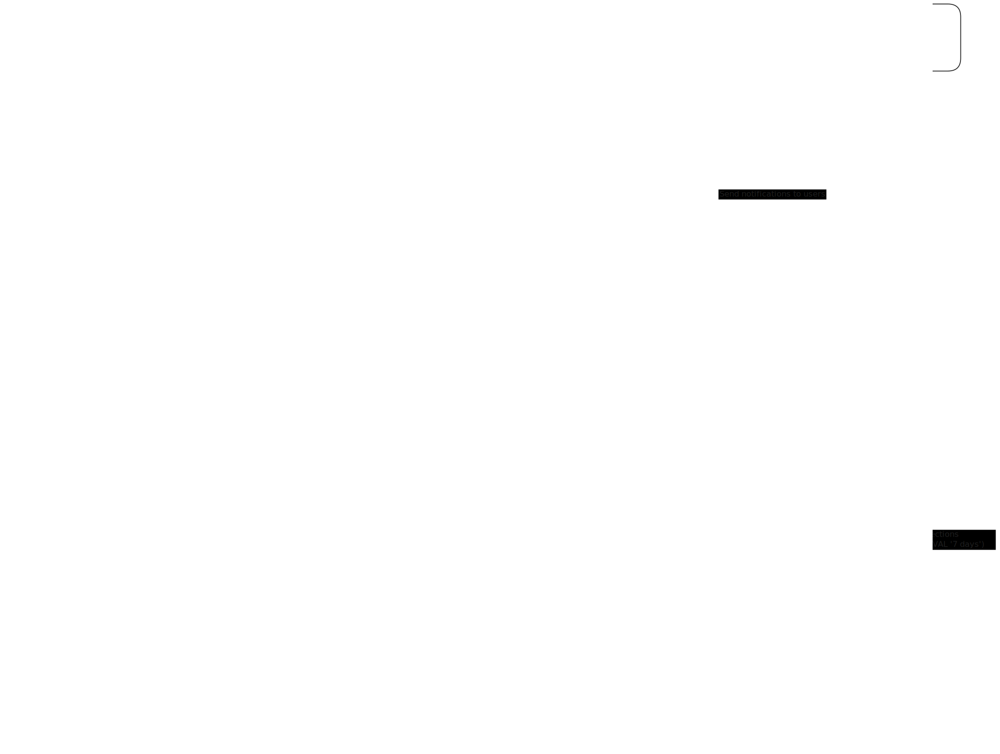

  

# TVTrash 

**TVTrash** is a webapp designed for residents of **Treviso, Italy**. It provides an intuitive interface to discover the official waste collection calendar from the local waste management company, helping you stay organized and eco-friendly.

**Key Features:**
- 📅 **Waste Collection Calendar:** Instantly check which waste types will be collected on any given day.
- 🔔 **Telegram Notifications:** Configure reminders to get notified the day before collection, so you never miss a pickup.
- 🌍 **Local Focus:** Tailored for Treviso city, with accurate, up-to-date data.

## About the project

This repository is a **monorepo** containing all the core components needed for TVTrash:

- **frontend**  
  A [SolidJS](https://solidjs.com) web application providing a user-friendly interface for Treviso residents to view the waste collection calendar and configure Telegram notifications.

- **scraper**  
  Python scripts that automatically scrape waste collection data from the official website of the local waste management company, ensuring the app always displays up-to-date information.

- **supabase**  
  Contains the database schema and edge functions for managing and serving waste collection data, notifications, and user preferences using [Supabase](https://supabase.com).

- **infrastructure**  
  A [Terraform](https://www.terraform.io) project that defines the infrastructure as code for deploying the Supabase backend and the frontend application on [Render](https://render.com).

Each project is independent, allowing for modular development and deployment.

## Application Flow Chart

  

